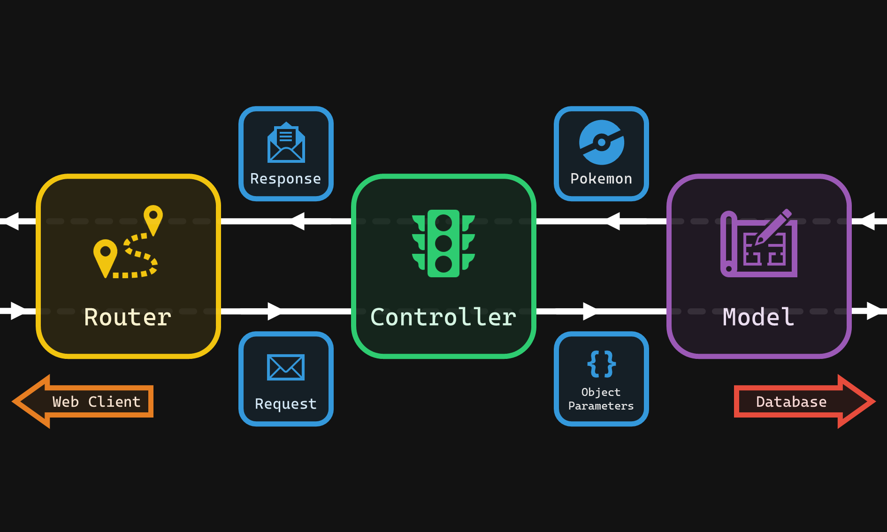

# Exercise 2.3 - Controllers 🚥

- 💯 **Worth**: 1%
- 📅 **Due**: February 27, 2020 @ 23:59
- 🙅🏽‍ **Penalty**: Late submissions lose 10% per day to a maximum of 3 days. Nothing is accepted after 3 days and a grade of 0% will be given.

## 🎯 Objectives

- **Write** `Controller` classes to handle the job of talking to the `Model`.
- **Employ** the _Single Responsibility Principle_ by separating out the `Router` logic of talking to the `Model` to the `Controller` instead.

## 🔨 Setup

1. Navigate to `~/web-ii/Exercises`.
2. Clone the Git repo `git clone <paste URL from GitHub>` (without the angle brackets).
3. You should now have a folder inside `Exercises` called `exercise-2_3-githubusername`.

   - If you want, you can rename this folder `2.3-Controllers` for consistency's sake! 😉
4. Copy over the `models` and `router` folders from E2.2:

   ```text
   2.3-Controllers
   ├── src
   │   ├── App.js
   │   ├── controllers
   │   │   ├── Controller.js
   │   │   ├── ErrorController.js
   │   │   ├── HomeController.js
   │   │   └── PokemonController.js
   │   ├── database
   │   │   ├── .env
   │   │   └── Database.js
   │   ├── models <--------- Copy over from E2.2
   │   │   ├── Model.js
   │   │   └── Pokemon.js
   │   └── router <--------- Copy over from E2.2
   │       ├── Request.js
   │       ├── Response.js
   │       └── Router.js
   └── tests
       ├── controller.test.js
       ├── http.test.js
       ├── request.test.js
       ├── response.test.js
       └── router.test.js
   ```

## 🔍 Context

In E2.2, we learned about the `Router` class and the role it plays in a web application. The `Router` we made was responsible for instantiating the correct `Model` based on the `Request`. Not only did it instantiate the `Model`, but it also decided what method to call on the `Model`. In OOP, when a class starts having multiple responsibilities, this is known as a [code smell](https://sourcemaking.com/refactoring/smells).

> 👃 An example of a smell that you're already familiar with is when you encounter blocks of code that are repeated in many places of your program. To get rid of the smell, you would refactor your code by creating a function where the logic is written only once. Then, all the repeating blocks of code get replaced with a single, descriptive, function call - no more smell!

Always strive to write classes/functions that are as small as possible and (ideally) only responsible for one job. The official term for this concept is the [Single Responsibility Principle](https://youtu.be/UQqY3_6Epbg?t=86). What this means for us is extracting out some of the current router's logic, and creating a dedicated class for that extracted logic. If you haven't guessed by now, this is where the `Controller` comes into play!



The router no longer has to worry about which method to call on which model. Now, the router is only concerned with what controller to instantiate. The controller will take care of calling the right method on the model. If this concept still seems abstract to you, that's okay! You'll get a much better idea of why this is useful after you complete this exercise. 😉

### 🐞 Debugging

I would recommend only debugging **either** the server terminal **or** the test terminal at any given time. Having two debugger terminals open and running can get messy. When debugging any test that is not making real HTTP requests (i.e. anything except `http.test.js`) then you should have the debug terminal run `npm run test`. If you want to debug your code that receives real requests, then the debug terminal should be the one running `npm run server`.

### 🧪 Tests

The test suites for this exercise are very similar to the last exercise, with the exception of `controller.test.js` and `router.test.js`. **Please complete the tests in this order:**

1. `request.test.js`: All the tests in this suite will be broken because the request no longer parses a model; it parses a controller instead.
2. `response.test.js`: All the tests in this suite should pass from the start since nothing in this class should change from the introduction of controllers.
3. `controller.test.js`: This suite will test if your controllers:
   1. Have the correct variables and functions.
   2. Call the correct functions based on the passed in request object.
   3. Return the correct response object based on the request.
4. `router.test.js`: This suite is much different than the one in E2.2. It now tests if your router instantiates the correct controller, **not a model**, based on the request.
5. `http.test.js`: Theoretically, once all the tests in the above suites pass, this suite should pass with little to no tweaking.

## 🚦 Let's Go

Just as last time, the models and database have been provided, so you don't have to worry about those. Your job is to write four classes (`Controller`, `PokemonController`, `HomeController`, and `ErrorController`) that will handle the following requests:

| HTTP Method | Route           | Controller | Controller Method | Model Method | Database Method |
| ----------- | --------------- | ---------- | ----------------- | ------------ | --------------- |
| `GET`       | `/`             | Home       |                   |              |                 |
| `ANY`       | `/{garbage}`    | Error      |                   |              |                 |
| `POST`      | `/pokemon`      | Pokemon    | `new`             | `create`     | `insert`        |
| `GET`       | `/pokemon`      | Pokemon    | `list`            | `findAll`    | `select`        |
| `GET`       | `/pokemon/{id}` | Pokemon    | `show`            | `findById`   | `select`        |
| `PUT`       | `/pokemon/{id}` | Pokemon    | `edit`            | `save`       | `update`        |
| `DELETE`    | `/pokemon/{id}` | Pokemon    | `destroy`         | `remove` ⭐   | `delete`        |

> ⭐ Rename the model's `delete` function to `remove`. I've intentionally given a different name to all three methods for a given route (ex. `list`, `findAll`, and `select`) in an attempt to highlight the distinction between each of these entities (ex. `Controller`, `Model`, and `Database`).

### 🚥 Abstract Controller

This class is responsible for encapsulating common logic among the concrete controllers: `HomeController`, `ErrorController`, and `PokemonController`. This class should never be instantiated directly in your code, it should only be extended by the concrete controllers.

> 💡 This concept is known as an [abstract class](https://www.techopedia.com/definition/17408/abstract-class). JS does not have abstract classes built into the language, so the best we can do is to follow the convention.

- **Variables**
  - `Request request`: Contains parsed information from the incoming HTTP request.
  - `Response response`: Contains the data to be sent in the outgoing HTTP response.
  - `Function action`: This will be the function the controller will call on itself depending on `this.request.getRequestMethod()`.
- **Functions**
  - `constructor`: Initializes the `request` and `response`.
  - `setAction`: This function is called by the concrete controller when the concrete controller is determining which method to call in its constructor. For example, if the concrete controller determines that the request method is `POST`, then it will set the action to `new`. Later, `new()` will be invoked by `doAction`.
  - `getAction`: Returns the function that is stored in `this.action`.
  - `doAction`: This function invokes the function that is stored in `this.action`. After calling `this.action()`, this function will return the `Response` object that was returned from calling `this.action()`.
  - `error`: Calls `this.response.setResponse()`, sets the status code to `404` and the message to `Invalid request!`, and returns `this.response`.

### 🏡 Home Controller

In the future, this class will be responsible for constructing the `View` for the homepage. For now, it will return a `Response` object that contains a `message` with the string `'Homepage!'`.

- **Variables**
  - The concrete controllers have no instance variables of their own. They share all of their variables with the parent abstract `Controller`.
- **Functions**
  - `constructor`:
    - Takes in a `Request` and `Response` and passes them up to the parent abstract `Controller`.
    - Sets the `action` to `this.home`.
  - `home`: Calls `this.response.setResponse()`, sets the message to `Homepage!`, and returns `this.response`.

### ⚠️ Error Controller

This class is responsible for returning an error `Response` whenever the request method or path are invalid. The actual `error` function lives in the parent abstract `Controller` since all other concrete controllers can also set error responses.

- **Variables**
  - The concrete controllers have no instance variables of their own. They share all of their variables with the parent abstract `Controller`.
- **Functions**
  - `constructor`:
    - Takes in a `Request` and `Response` and passes them up to the parent abstract `Controller`.
    - Sets the `action` to `this.error`.

### ⚡ Pokemon Controller

This class is responsible for invoking methods on the `Pokemon` model.

- **Variables**
  - The concrete controllers have no instance variables of their own. They share all of their variables with the parent abstract `Controller`.
- **Functions**
  - `constructor`:
    - Takes in a `Request` and `Response` and passes them up to the parent abstract `Controller`.
    - The request's `requestMethod` is how we decide which function we need to invoke in this class. The `action` will be set to the function we want to invoke. For example, if we're dealing with a `POST` request, `action` will be `this.new`. See above table for reference.
      > 💡 Be careful **not to invoke** the function that you're passing into `this.setAction()`. You just want to pass the function that will be called later by `this.doAction()`.
    - If the request method is not `POST`, `GET`, `PUT`, or `DELETE`, then set the `action` to `this.error`. Remember that the `error()` function lives in the parent abstract controller.
  - `new`:
    1. Calls the `create` method on the `Pokemon` model.
    2. Calls `this.response.setResponse()`, sets the appropriate message/payload, and returns `this.response`.
  - `list`:
    1. Calls the `findAll` method on the `Pokemon` model.
    2. Calls `this.response.setResponse()`, sets the appropriate message/payload, and returns `this.response`.
  - `show`:
    1. Calls the `findById` method on the `Pokemon` model.
    2. Calls `this.response.setResponse()`, sets the appropriate message/payload, and returns `this.response`.
  - `edit`:
    1. Find the Pokemon we want to update by its ID.
    2. If found, then edit the fields of the Pokemon using its setters.
    3. Call the `save` method on the `Pokemon` model.
    4. Calls `this.response.setResponse()`, sets the appropriate message/payload, and returns `this.response`.
  - `destroy`:
    1. Find the Pokemon we want to delete by its ID.
    2. If found, then call the `remove` method on the `Pokemon` model.
    3. Calls `this.response.setResponse()`, sets the appropriate message/payload, and returns `this.response`.

### ✉️ Request

The only things that change in the `Request` class are that all references to "model" should now be "controller":

- `modelName` becomes `controllerName`.
- `getModelName` becomes `getControllerName`.

### 💌 Response

Nothing in `Response` changes! It still has the same responsibility for getting the data ready to go back to the client.

### 🗺️ Router

In the previous exercise, the `Router` spoke directly to the `Model`. We're going to modify the `Router` so that it talks to the `Controller` now instead of the `Model`.

- **Variables**
  - `Request request`: Contains parsed information from the incoming HTTP request.
  - `Response response`: Contains the data to be sent in the outgoing HTTP response.
  - `Controller controller`: The controller based on the `controllerName` parsed from the `Request`. For example, if the `Request` parsed the `controllerName` as `pokemon`, then the `controller` for `Router` would be an instance of `PokemonController`.
    - For blank paths, the `controller` should be an instance of `HomeController`;
    - For invalid paths, the `controller` should be an instance of `ErrorController`;

- **Functions**
  - `constructor`: Initializes the `request` and `response`. Also calls `setController()` and passes in the `controllerName` from the `request`.
  - `setController`: Determines the controller to instantiate based on the passed in `controllerName`.
    - If the `request` parsed `''`, then `this.controller` should be an instance of `HomeController`;
    - If the `request` parsed `pokemon`, then `this.controller` should be an instance of `PokemonController`;
    - Otherwise, `this.controller` should be an instance of `ErrorController`;
  - `dispatch`: Calls the `doAction` method on `this.controller`. Returns the `Response` object that should be returned by `doAction`.

## 🌈 Conclusion

Once you've got all the tests passing, take one last look at `Router.js` from E2.2 and compare it to E2.3. Notice the huge difference in size - especially in the `dispatch` function! Imagine if we had several other big entities, similar to `Pokemon.js`, each with their own methods to create/read/update/delete - the `dispatch` function would have been hundreds of lines long. By separating out this logic into bespoke `Controller` classes, we have successfully employed the _Single Responsibility Principle_! 🎉

## 📥 Submission

Check that all tests are passing by removing all occurrences of `.only` and running the test suite for the final time. Once you've made your final `git push` to GitHub, here's what you have to do to submit:

1. Go to [Gradescope](https://www.gradescope.ca/courses/828) and click the link for this exercise.
2. Select the correct repository and branch from the dropdown menus.
3. Click _Upload_.
4. Wait for the autograder to finish grading your submission. Once it's done, you should see the final output of the test results as well as your grade on the top right.

### 💯 Grade Distribution

- `controller.test.js` = **80%**
- `router.test.js` = **10%**
- `http.test.js` = **10%**
